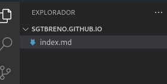

# Primeiras anotações
## Estas são as extensões iniciais do VSCODE que instalei

* paste image
* markdown editor
* Brazilian Portuguese - Code Spell
* Live Server
* Markdown Preview Github Styling
* Marp for VS Code
  * python ident
* powershell
  - vscode-pdf
* Auto Rename Tag

## Copiar imagens usando o lightshot

* Colar com: Ctrl + Alt + V

## Links

Selecionar a palavra que quer o link, e colar em cima dela.

Para acessar essa página basta [clicar aqui](https://sgtbreno.github.io/).

## Configurar o Auto Save

## Criar notas basta usar o simbolo > 

> Esta é uma nota

    